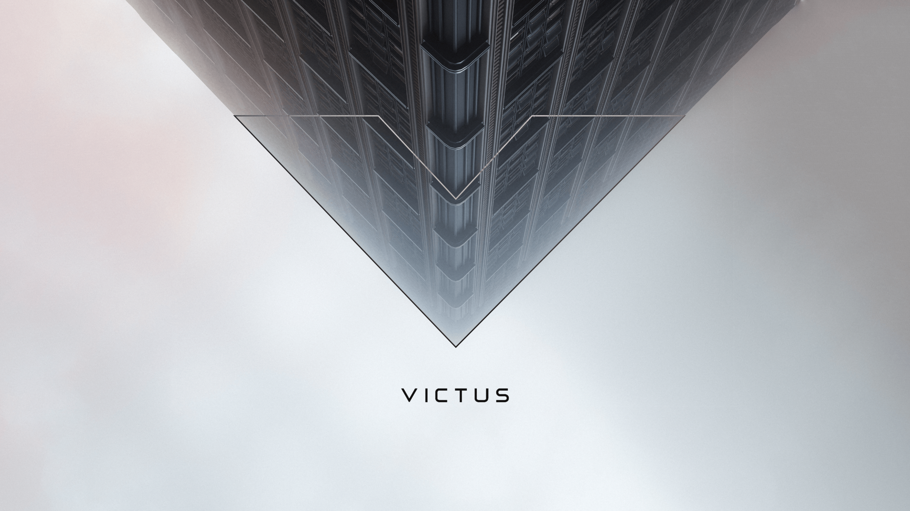

# HP Victus GRUB Theme

A minimalistic, premium GRUB theme inspired by HP Victus branding featuring a misty forest background and sleek modern design.



## Features

- **Premium Design**: Clean, minimalistic interface with misty forest background
- **Modern Color Scheme**: Sleek blue (#2980B9) highlights for a professional look
- **Professional Typography**: Roboto font family for crisp, readable text
- **Extended OS Support**: Icons for Linux, Windows, Recovery, Arch Linux, and Endeavour OS
- **Responsive Layout**: Menu positioned at 58% height for optimal visual balance
- **Accessible**: High contrast colors for excellent readability
- **Comprehensive Testing**: Built-in validation script ensures theme integrity

## Installation

### Automatic Installation (Recommended)

1. Clone or download this repository
2. Navigate to the repository directory
3. Run the installation script with root privileges:

```bash
sudo ./install.sh
```

The script will:
- Copy theme files to `/boot/grub/themes/victus/`
- Update `/etc/default/grub` with theme configuration
- Backup your existing GRUB configuration
- Regenerate GRUB configuration automatically

### Manual Installation

1. Copy the theme directory:
```bash
sudo cp -r themes/victus /boot/grub/themes/
```

2. Edit `/etc/default/grub` and add/modify:
```bash
GRUB_THEME=/boot/grub/themes/victus/theme.txt
GRUB_TIMEOUT=10
```

3. Update GRUB configuration:
```bash
sudo update-grub
# or on some systems:
sudo grub-mkconfig -o /boot/grub/grub.cfg
```

4. Reboot to see the new theme

## Theme Validation

Before and after installation, you can validate the theme integrity using the included validation script:

```bash
./validate-theme.sh
```

This comprehensive script checks:
- File existence and structure
- Theme configuration syntax
- PNG file integrity
- Font file validity (if GRUB tools available)
- Color scheme configuration
- OS icon mappings
- Theme completeness score

### Running Tests
The validation script provides detailed feedback:
- ✓ Green checkmarks indicate successful validation
- ⚠ Yellow warnings indicate optional features or recommendations  
- ✗ Red errors indicate critical issues that should be fixed

Example output:
```
================================================
HP Victus GRUB Theme Validation
================================================
Checking theme structure...
✓ Theme configuration: themes/victus/theme.txt
✓ Modern blue color scheme (#2980B9) configured
✓ Arch Linux icon mapping configured
✓ Endeavour OS icon mapping configured
Theme completeness: 100% (12/12 components)
✓ Excellent theme completeness
================================================
✓ Theme validation PASSED - No critical issues found
The theme is ready for installation!
================================================
```

## Theme Structure

```
themes/victus/
├── theme.txt              # Main theme configuration
├── background.png         # Misty forest background (1920x1080)
├── fonts/                 # Font files
│   ├── Roboto-Regular-22.pf2  # Menu items font
│   └── Roboto-Bold-24.pf2     # Title font
├── icons/                 # OS type icons
│   ├── linux.png         # Linux/Unix systems
│   ├── windows.png       # Microsoft Windows
│   ├── recovery.png      # Recovery/rescue entries
│   ├── arch.png          # Arch Linux
│   └── endeavouros.png   # Endeavour OS
└── highlight_*.png        # Selection highlight graphics
```

## Font Conversion

The theme uses Roboto fonts converted to GRUB's PF2 format. To convert TTF fonts to PF2:

### Prerequisites
```bash
sudo apt install grub2-common fonts-roboto
```

### Conversion Commands
```bash
# For menu items (22px)
grub-mkfont -o themes/victus/fonts/Roboto-Regular-22.pf2 -s 22 /usr/share/fonts/truetype/roboto/unhinted/RobotoTTF/Roboto-Regular.ttf

# For titles (24px)
grub-mkfont -o themes/victus/fonts/Roboto-Bold-24.pf2 -s 24 /usr/share/fonts/truetype/roboto/unhinted/RobotoTTF/Roboto-Bold.ttf
```

### Using Custom Fonts
To use different fonts:

1. Install your desired TTF font
2. Convert to PF2 format:
```bash
grub-mkfont -o themes/victus/fonts/YourFont-Size.pf2 -s SIZE /path/to/font.ttf
```
3. Update `theme.txt` font references

## Color Scheme

| Element | Color | Usage |
|---------|-------|-------|
| `#2980B9` | Modern Blue | Selected item background, progress bar |
| `#FFFFFF` | Pure White | Selected item text, title |
| `#CCCCCC` | Light Gray | Normal menu text, icons |
| `#333333` | Dark Gray | Progress bar background |
| `#666666` | Medium Gray | Border elements |
| `#000000` | Black | Desktop/fallback background |

### Legacy Color Support
The theme previously used `#FF4500` (Victus Orange) which can be restored by editing the color values in `theme.txt`.

## Customization

### Changing Colors
Edit `themes/victus/theme.txt` and modify color values:
- `item_color`: Normal text color
- `selected_item_color`: Highlighted text color
- Highlight graphics: Recreate `highlight_*.png` files

### Adjusting Layout
Modify position and size values in `theme.txt`:
- `left`, `top`: Position (percentage or pixels)
- `width`, `height`: Dimensions (percentage or pixels)

### Background Image
Replace `themes/victus/background.png` with your image:
- Recommended resolution: 1920x1080 or higher
- Format: PNG for best quality
- Consider menu area positioning at ~58% height

## Troubleshooting

### Theme Not Appearing
1. Verify GRUB configuration:
```bash
grep GRUB_THEME /etc/default/grub
```

2. Check file permissions:
```bash
sudo ls -la /boot/grub/themes/victus/
```

3. Regenerate GRUB config:
```bash
sudo update-grub
```

### Font Issues
- Ensure PF2 font files exist in `themes/victus/fonts/`
- Check font paths in `theme.txt` are correct
- Verify fonts were converted with correct sizes

### Icons Not Showing
- Check icon files exist in `themes/victus/icons/`
- Verify icon class mappings in `theme.txt`
- Icons should be 24x24 PNG format

## Uninstallation

### Using Backup (if installed with script)
```bash
sudo cp /etc/default/grub.backup.YYYYMMDD_HHMMSS /etc/default/grub
sudo update-grub
```

### Manual Removal
1. Edit `/etc/default/grub`
2. Remove or comment out `GRUB_THEME=` line
3. Run `sudo update-grub`
4. Optionally remove theme files: `sudo rm -rf /boot/grub/themes/victus`

## Requirements

- GRUB 2.x bootloader
- Linux system with administrative access
- Approximately 2MB disk space in `/boot` partition

## License

This theme is provided as-is for educational and personal use. Background images and branding elements may have their own licensing terms.

## Contributing

Feel free to submit issues, suggestions, or improvements via GitHub issues and pull requests.
