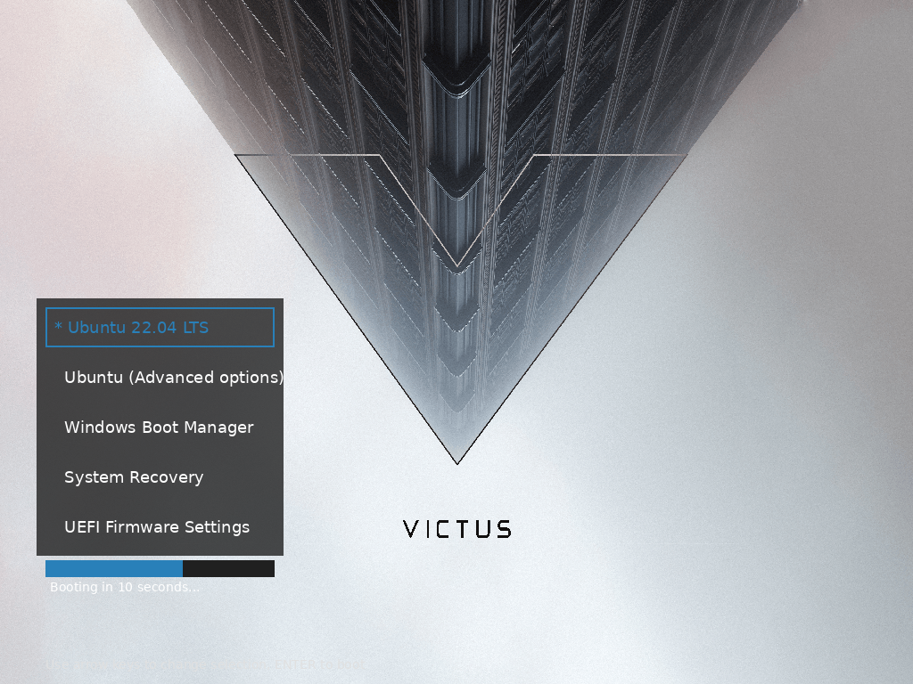

# HP Victus GRUB Theme

A minimalistic, premium GRUB theme inspired by HP Victus branding featuring ultra-sleek modern design with optimized layout and enhanced visual hierarchy.


## Working Theme Preview



*The enhanced HP Victus GRUB theme featuring left-positioned menu layout, atmospheric smokey skyscraper background, dark semi-transparent overlays, and modern blue highlights optimized for maximum readability. The theme shows a typical boot menu with Ubuntu, Windows, and recovery options, demonstrating the clean modern aesthetic with the #2980B9 blue color scheme.*

## Features

- **Ultra-Sleek Design**: Refined minimalistic interface with dark semi-transparent overlays
- **Enhanced Readability**: Left-positioned menu (5%/40% position) avoids overlapping Victus branding
- **Atmospheric Background**: Smokey skyscraper scene with Victus branding optimized for menu placement
- **High Contrast Colors**: White text (#FFFFFF) on dark overlays for maximum readability
- **Premium Typography**: Roboto font family with enhanced contrast for superior visibility
- **Extended OS Support**: Icons for Linux, Windows, Recovery, Arch Linux, and Endeavour OS
- **Smart Layout**: Menu repositioned with 35% width and dark overlays (#202020C0) for excellent contrast
- **Enhanced Accessibility**: High contrast white text and reduced transparency for optimal readability
- **Comprehensive Testing**: Built-in validation script ensures theme integrity

## Installation

### Automatic Installation (Recommended)

1. Clone or download this repository
2. Navigate to the repository directory
3. Run the installation script with root privileges:

```bash
sudo ./install.sh
```

The script will:
- Copy theme files to `/boot/grub/themes/victus/`
- Update `/etc/default/grub` with theme configuration
- Backup your existing GRUB configuration
- Regenerate GRUB configuration automatically

### Manual Installation

#### Step-by-Step Manual Installation

**Step 1: Download and Extract Theme**
```bash
# Clone the repository
git clone https://github.com/RedheadedGamer/victus_grub.git
cd victus_grub

# Or if you downloaded a ZIP file, extract it and navigate to the directory
```

**Step 2: Copy Theme Files to GRUB Directory**
```bash
# Create the themes directory if it doesn't exist
sudo mkdir -p /boot/grub/themes

# Copy the victus theme directory
sudo cp -r themes/victus /boot/grub/themes/

# Verify the files were copied correctly
sudo ls -la /boot/grub/themes/victus/
```

**Step 3: Backup Current GRUB Configuration**
```bash
# Create a backup of your current GRUB configuration
sudo cp /etc/default/grub /etc/default/grub.backup.$(date +%Y%m%d_%H%M%S)
```

**Step 4: Edit GRUB Configuration**
```bash
# Open the GRUB configuration file in your preferred editor
sudo nano /etc/default/grub
# or
sudo vim /etc/default/grub
# or
sudo gedit /etc/default/grub
```

Add or modify these lines in `/etc/default/grub`:
```bash
# Set the theme path
GRUB_THEME=/boot/grub/themes/victus/theme.txt

# Set timeout (optional, adjust as needed)
GRUB_TIMEOUT=10

# Optional: Set resolution for better theme display
GRUB_GFXMODE=1024x768

# Optional: Ensure graphics terminal is used
GRUB_TERMINAL_OUTPUT="gfxterm"
```

**Step 5: Verify File Permissions**
```bash
# Ensure proper permissions for theme files
sudo chmod -R 644 /boot/grub/themes/victus/
sudo chmod 755 /boot/grub/themes/victus/
sudo find /boot/grub/themes/victus/ -type d -exec chmod 755 {} \;
```

**Step 6: Update GRUB Configuration**

For **Ubuntu/Debian-based systems**:
```bash
sudo update-grub
```

For **Fedora/RHEL/CentOS systems**:
```bash
sudo grub2-mkconfig -o /boot/grub2/grub.cfg
# For UEFI systems, you might need:
sudo grub2-mkconfig -o /boot/efi/EFI/fedora/grub.cfg
```

For **Arch Linux**:
```bash
sudo grub-mkconfig -o /boot/grub/grub.cfg
```

For **openSUSE**:
```bash
sudo grub2-mkconfig -o /boot/grub2/grub.cfg
```

**Step 7: Verify Installation**
```bash
# Check if the theme path is correctly set
grep GRUB_THEME /etc/default/grub

# Verify theme files exist
ls -la /boot/grub/themes/victus/theme.txt
```

**Step 8: Reboot and Test**
```bash
sudo reboot
```

#### Installation for Different Boot Systems

**For UEFI Systems:**
- Theme files location may vary: `/boot/efi/EFI/[distro]/themes/victus/`
- Check your distribution's GRUB documentation for exact paths

**For Legacy BIOS Systems:**
- Standard location: `/boot/grub/themes/victus/`
- Configuration file: `/etc/default/grub`

#### Troubleshooting Manual Installation

**Theme Not Showing:**
1. Check file paths are correct:
   ```bash
   sudo ls -la /boot/grub/themes/victus/theme.txt
   ```

2. Verify GRUB configuration:
   ```bash
   grep GRUB_THEME /etc/default/grub
   ```

3. Check for syntax errors:
   ```bash
   sudo grub-script-check /boot/grub/themes/victus/theme.txt
   ```

**Permission Issues:**
```bash
# Fix ownership and permissions
sudo chown -R root:root /boot/grub/themes/victus/
sudo chmod -R 644 /boot/grub/themes/victus/
sudo chmod 755 /boot/grub/themes/victus/
sudo find /boot/grub/themes/victus/ -type d -exec chmod 755 {} \;
```

**Font Issues:**
```bash
# Verify font files exist and have correct extensions
ls -la /boot/grub/themes/victus/fonts/*.pf2
```

**Recovery (Restore Original Configuration):**
```bash
# Restore from backup
sudo cp /etc/default/grub.backup.* /etc/default/grub
sudo update-grub  # or appropriate command for your distribution
sudo reboot
```

## Theme Validation

Before and after installation, you can validate the theme integrity using the included validation script:

```bash
./validate-theme.sh
```

This comprehensive script checks:
- File existence and structure
- Theme configuration syntax
- PNG file integrity
- Font file validity (if GRUB tools available)
- Color scheme configuration
- OS icon mappings
- Theme completeness score

### Running Tests
The validation script provides detailed feedback:
- ✓ Green checkmarks indicate successful validation
- ⚠ Yellow warnings indicate optional features or recommendations  
- ✗ Red errors indicate critical issues that should be fixed

Example output:
```
================================================
HP Victus GRUB Theme Validation
================================================
Checking theme structure...
✓ Theme configuration: themes/victus/theme.txt
✓ Modern blue color scheme (#2980B9) configured
✓ Arch Linux icon mapping configured
✓ Endeavour OS icon mapping configured
Theme completeness: 100% (12/12 components)
✓ Excellent theme completeness
================================================
✓ Theme validation PASSED - No critical issues found
The theme is ready for installation!
================================================
```

## Theme Structure

```
themes/victus/
├── theme.txt              # Main theme configuration
├── background.png         # Smokey skyscraper background (3840x2160)
├── fonts/                 # Font files
│   ├── Roboto-Regular-22.pf2  # Menu items font
│   └── Roboto-Bold-24.pf2     # Title font
├── icons/                 # OS type icons
│   ├── linux.png         # Linux/Unix systems
│   ├── windows.png       # Microsoft Windows
│   ├── recovery.png      # Recovery/rescue entries
│   ├── arch.png          # Arch Linux
│   └── endeavouros.png   # Endeavour OS
└── highlight_*.png        # Selection highlight graphics
```

## Font Conversion

The theme uses Roboto fonts converted to GRUB's PF2 format. To convert TTF fonts to PF2:

### Prerequisites
```bash
sudo apt install grub2-common fonts-roboto
```

### Conversion Commands
```bash
# For menu items (22px)
grub-mkfont -o themes/victus/fonts/Roboto-Regular-22.pf2 -s 22 /usr/share/fonts/truetype/roboto/unhinted/RobotoTTF/Roboto-Regular.ttf

# For titles (24px)
grub-mkfont -o themes/victus/fonts/Roboto-Bold-24.pf2 -s 24 /usr/share/fonts/truetype/roboto/unhinted/RobotoTTF/Roboto-Bold.ttf
```

### Using Custom Fonts
To use different fonts:

1. Install your desired TTF font
2. Convert to PF2 format:
```bash
grub-mkfont -o themes/victus/fonts/YourFont-Size.pf2 -s SIZE /path/to/font.ttf
```
3. Update `theme.txt` font references

## Color Scheme

| Element | Color | Usage |
|---------|-------|-------|
| `#2980B9` | Modern Blue | Selected item background, progress bar foreground |
| `#FFFFFF` | Pure White | Selected item text, title |
| `#E0E0E0` | Light Silver | Normal menu text, enhanced readability |
| `#2C3E50` | Dark Slate | Progress bar background |
| `#5D6D7E` | Medium Slate | Border elements, refined contrast |
| `#000000` | Black | Desktop/fallback background |

### Enhanced Color Philosophy
The updated color scheme provides superior contrast and readability with a modern, professional appearance. The modern blue (#2980B9) offers better visibility while maintaining the sleek aesthetic.

## Customization

### Changing Colors
Edit `themes/victus/theme.txt` and modify color values:
- `item_color`: Normal text color
- `selected_item_color`: Highlighted text color
- Highlight graphics: Recreate `highlight_*.png` files

### Adjusting Layout
Modify position and size values in `theme.txt` (current optimized values):
- **Menu Position**: `left = 5%`, `top = 40%` (left-positioned to avoid Victus branding)
- **Menu Size**: `width = 35%`, `height = 35%` (optimized proportions)
- **Progress Bar**: `left = 5%`, `top = 80%`, `width = 35%` (aligned with menu)
- **Enhanced Spacing**: `item_spacing = 6`, `item_padding = 12` (improved readability)

### Background Image
Replace `themes/victus/background.png` with your image:
- Recommended resolution: 1920x1080 or higher
- Format: PNG for best quality
- Consider menu area positioning at 55% height (updated for sleeker layout)

## Troubleshooting

### Theme Not Appearing
1. Verify GRUB configuration:
```bash
grep GRUB_THEME /etc/default/grub
```

2. Check file permissions:
```bash
sudo ls -la /boot/grub/themes/victus/
```

3. Regenerate GRUB config:
```bash
sudo update-grub
```

### Font Issues
- Ensure PF2 font files exist in `themes/victus/fonts/`
- Check font paths in `theme.txt` are correct
- Verify fonts were converted with correct sizes

### Icons Not Showing
- Check icon files exist in `themes/victus/icons/`
- Verify icon class mappings in `theme.txt`
- Icons should be 24x24 PNG format

## Uninstallation

### Using Backup (if installed with script)
```bash
sudo cp /etc/default/grub.backup.YYYYMMDD_HHMMSS /etc/default/grub
sudo update-grub
```

### Manual Removal
1. Edit `/etc/default/grub`
2. Remove or comment out `GRUB_THEME=` line
3. Run `sudo update-grub`
4. Optionally remove theme files: `sudo rm -rf /boot/grub/themes/victus`

## Requirements

- GRUB 2.x bootloader
- Linux system with administrative access
- Approximately 2MB disk space in `/boot` partition

## License

This theme is provided as-is for educational and personal use. Background images and branding elements may have their own licensing terms.

## Contributing

Feel free to submit issues, suggestions, or improvements via GitHub issues and pull requests.
